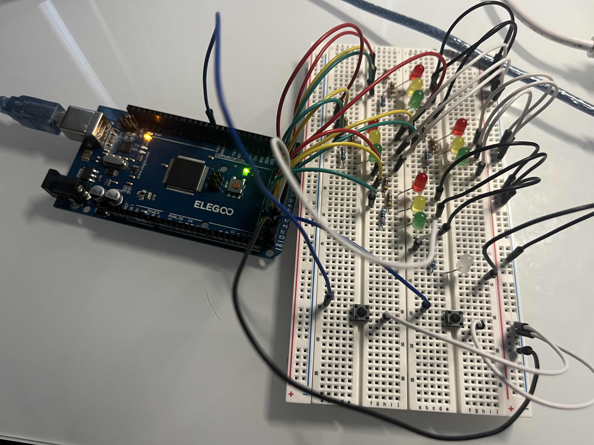
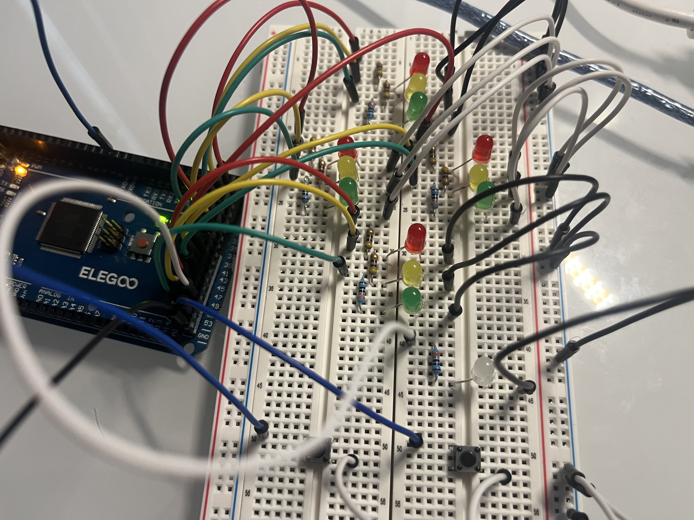

# Arduino Traffic Light Controller

A four-way **traffic light control system** built on the **Arduino Mega 2560**, featuring **pedestrian crossing** and **emergency override** modes.  
This project simulates real-world intersection logic using a **finite state machine (FSM)** with **non-blocking timing**, making it an excellent demonstration of **embedded systems design**.

---

## Overview

This project models a real intersection with four traffic light heads (North–South and East–West), each having red, yellow, and green LEDs.  
The system cycles through light phases using precise, non-blocking timing with the Arduino `millis()` function — no `delay()` calls are used, allowing the controller to remain responsive to inputs at all times.

Two buttons provide user interaction:
- **Pedestrian button:** Requests a safe crossing phase, indicated by a **white pedestrian LED**.
- **Emergency button:** Triggers a flashing all-red mode to simulate emergency vehicle passage.

---

## Demo & Media

**Demo Video:**
[Watch on YouTube](https://youtu.be/WH35ogzfD9o)

**Circuit Layout:**

**Circuit Layout (Close-Up)**

## Features

- Four-way traffic light simulation (12 LEDs total)  
- Non-blocking timing using `millis()`  
- Finite State Machine (FSM) for clean logic flow  
- Interrupt-driven emergency mode (instant response)  
- Software-debounced pedestrian input  
- Dedicated pedestrian LED indicator  
- Modular design for easy hardware or logic expansion  

---

## Hardware Used

| Component | Quantity | Description |
|------------|-----------|-------------|
| Arduino Mega 2560 | 1 | Main controller board |
| Breadboards | 2 | Interconnected for four signal heads |
| LEDs | 13 | 12 for traffic lights (4× red/yellow/green) + 1 for pedestrian signal |
| Resistors | 13 | 330–470Ω per LED |
| Push Buttons | 2 | Pedestrian request & emergency mode |
| Jumper Wires | — | For all connections |
| USB Cable | 1 | For uploading and power |

---

## Pin Mapping

| Function | Pins |
|-----------|------|
| **North–South #1** | Red: 22, Yellow: 24, Green: 26 |
| **North–South #2** | Red: 28, Yellow: 30, Green: 32 |
| **East–West #1** | Red: 34, Yellow: 36, Green: 38 |
| **East–West #2** | Red: 40, Yellow: 42, Green: 44 |
| **Pedestrian LED** | 46 |
| **Pedestrian Button** | 49 |
| **Emergency Button (Interrupt)** | 2 |

---

## System Logic

The system cycles through these states:

1. **North–South Green** → 7 seconds  
2. **North–South Yellow** → 3 seconds  
3. **All Red** → 1 second 
4. **East–West Green** → 7 seconds  
5. **East–West Yellow** → 3 seconds  
6. **All Red** → 1 seconds  
7. *(If pedestrian button pressed)* → Pedestrian phase (7 seconds)

**Emergency mode:**  
When the emergency button is pressed, the controller interrupts normal operation and enters a **flashing all-red state** until the button is pressed again.

---

## Code Highlights

- Uses `millis()` for **non-blocking timing**  
- Implements a **finite state machine** for clean, modular logic  
- Handles asynchronous inputs (pedestrian + interrupt) safely  
- Uses **debouncing** and **volatile flags** for reliable input detection  

---

## How to Use

1. Wire the circuit following the pin layout above.  
2. Open the `.ino` file in the **Arduino IDE**.  
3. Select your board: **Arduino Mega 2560**.  
4. Upload the code to your board.  
5. Press the **pedestrian button** to activate the crossing phase.  
6. Press the **emergency button** to toggle flashing all-red mode.  

---

## Future Improvements

- Add seven-segment countdown timer for pedestrian crossing  
- Include ultrasonic sensors for traffic density simulation  
- Add Bluetooth or Wi-Fi module for remote monitoring  
- Display state transitions on an LCD